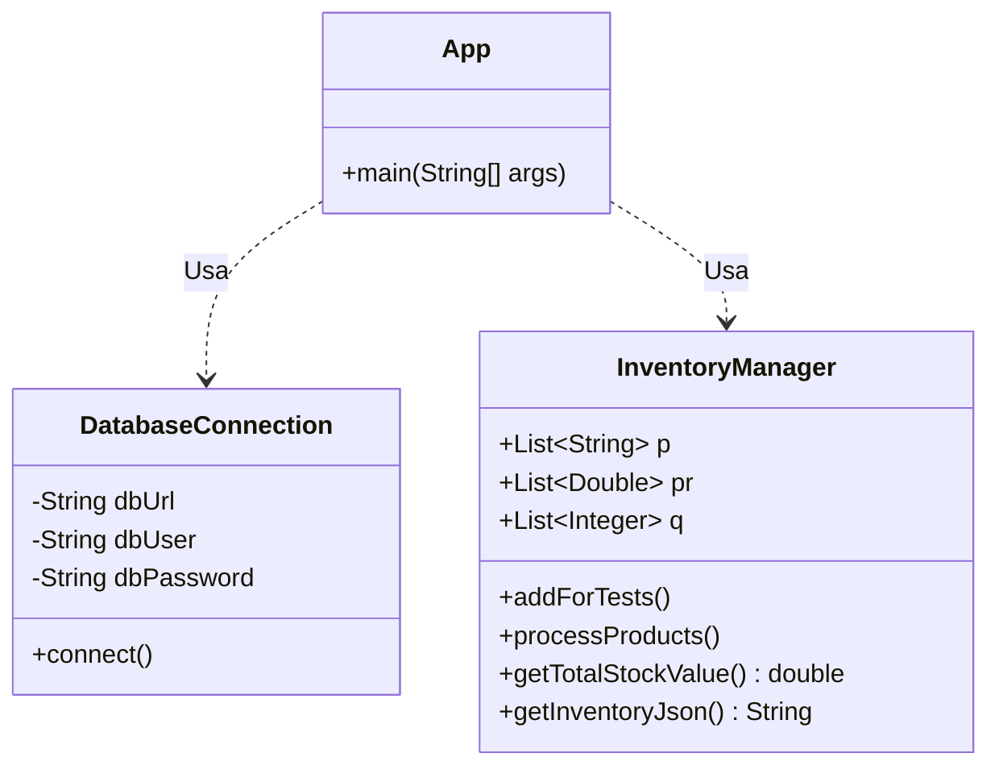

# LegacyWarehouse - Sistema de Gestión de Inventario Modernizado

Este proyecto es una aplicación de consola en Java diseñada para simular la gestión de un inventario de almacén. Originalmente un código "legacy" con múltiples fallas y malas prácticas, ha sido refactorizado, asegurado y modernizado a **Java 17**.

## 📊 Diagrama de la Aplicación



## 🚀 Funcionalidades Principales

### 1. Gestión de Inventario (`InventoryManager`)
El núcleo de la aplicación permite administrar productos con sus precios y cantidades.
*   **Procesamiento de Productos:** Recorre el inventario, calcula el valor individual (Precio x Cantidad) y genera un reporte en consola.
*   **Detección de Duplicados:** Identifica automáticamente si un producto ha sido ingresado múltiples veces.
    *   *Mejora:* Se optimizó el algoritmo de detección de $O(n^2)$ a $O(n)$ utilizando `HashSet`.
*   **Cálculo de Valor Total:** Calcula el valor monetario total de todo el stock en almacén, sumando automáticamente un impuesto del 5%.
    *   *Corrección:* Se arregló un error lógico crítico donde el impuesto se restaba en lugar de sumarse.
*   **Exportación a JSON:** Nueva funcionalidad que permite exportar todo el estado actual del inventario a una cadena en formato JSON, ideal para integraciones externas. Utiliza la librería **Gson** de Google.

### 2. Conectividad (`DatabaseConnection`)
Módulo simulado para la conexión a base de datos.
*   **Seguridad Mejorada:** Se eliminaron las credenciales hardcodeadas ("quemadas") en el código.
*   **Variables de Entorno:** Ahora la aplicación requiere la variable de entorno `DB_PASSWORD` para establecer la conexión de manera segura.
*   **Logs Seguros:** Se eliminó la impresión de contraseñas en la consola.

## 🛠 Stack Tecnológico

*   **Lenguaje:** Java 17 (OpenJDK).
*   **Gestor de Dependencias:** Apache Maven.
*   **Librerías:**
    *   `com.google.code.gson:gson` (v2.10.1): Para manejo y generación de JSON.
    *   `junit:junit` (v4.13.2): Para pruebas unitarias.

## ⚙️ Configuración y Ejecución

### Requisitos Previos
*   Java JDK 17 instalado.
*   Maven instalado.

### Variables de Entorno
Por razones de seguridad, es necesario configurar la contraseña de la base de datos antes de ejecutar la aplicación.

```bash
export DB_PASSWORD=tu_password_seguro
```

### Compilación
Para compilar el proyecto y descargar las dependencias:

```bash
mvn clean compile
```

### Ejecución
Para ejecutar la clase principal (asegúrate de haber compilado primero):

```bash
mvn exec:java -Dexec.mainClass="com.legacy.app.App"
```

## 🧪 Pruebas
El proyecto cuenta con una suite de pruebas unitarias que validan la lógica de negocio, incluyendo cálculos matemáticos y la generación correcta del JSON.

Para ejecutar las pruebas:

```bash
mvn test
```

## 📝 Historial de Cambios (Refactorización)
1.  **Corrección de Sintaxis:** Se arreglaron errores de compilación en `App.java`.
2.  **Optimización:** Se refactorizó `InventoryManager` para eliminar bucles anidados ineficientes.
3.  **Gestión de Dependencias:** Migración de `json-simple` (obsoleto) a `Gson` (moderno).
4.  **Java Upgrade:** Actualización del compilador de Java 1.8 a Java 17.
5.  **Hardening de Seguridad:** Eliminación de vulnerabilidades de exposición de credenciales.